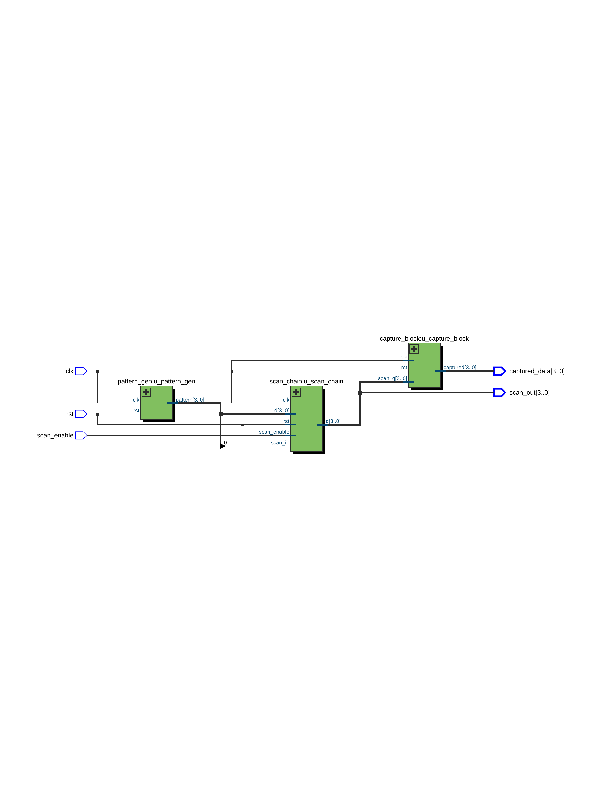
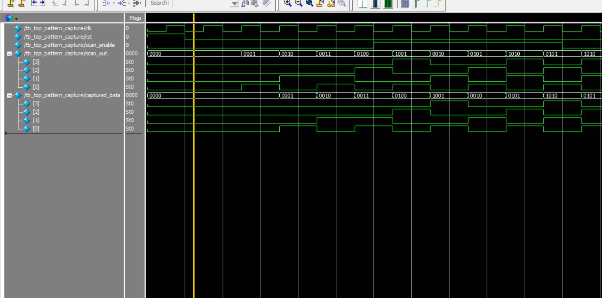

# 🧪 DFT Pattern Capture Chain

This project demonstrates a 4-bit scan chain with automatic pattern generation and data capture functionality.  
It is implemented in Verilog and verified using ModelSim simulation.

---

## 📂 Files

| File Name                    | Description                                         |
|-----------------------------|-----------------------------------------------------|
| `pattern_gen.v`             | 4-bit test pattern generator                        |
| `scan_dff.v`                | D flip-flop with scan capability                    |
| `scan_chain.v`              | 4-stage scan chain composed of scan_dff modules    |
| `capture_block.v`           | Captures scan_chain output for observation          |
| `top_pattern_capture.v`     | Top-level integration of generator, scan chain, and capture block |
| `wave_tb_top_pattern_capture.png` | Waveform output from ModelSim simulation       |
| `RTL_pattern_capture_chain.png`   | RTL schematic from Quartus Prime               |

---

## 🖼️ RTL Schematic

> Generated via Quartus Prime RTL Viewer

---

## 📈 Simulation Waveform

> Simulated using ModelSim. Shows pattern flow through scan chain and capture behavior.

---

## 🔧 Toolchain

- **Quartus Prime Lite 18.0** – RTL design and synthesis  
- **ModelSim - Intel FPGA Starter Edition 10.5b** – Simulation and waveform viewing

---

## 👤 Author

Huichingchang  
May 2025
